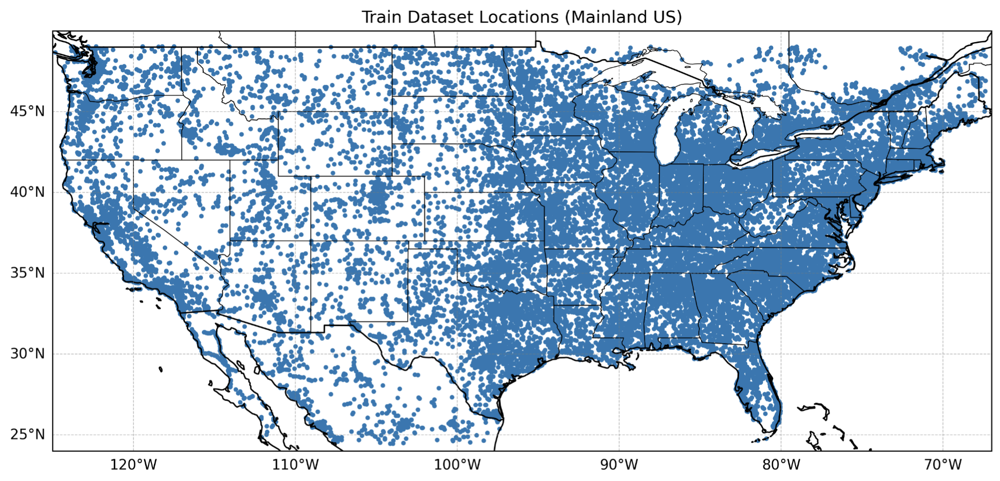

# Geoguessr AI

This agent will take in an image as input, analyze it, and generate a guess of where the image belongs to

Environment Scope: United States (excluding Alaska and Hawaii)

## Data Setup
We used an originally sourced dataset of roughly ~35,000 Google Maps Streetview images from areas around the United States between the coordinates,
- top left corner = (49.049081, -125.450687)
- bottom right corner = (24.455005, -67.343249)

### Downloading our dataset:
1. Go to: `https://www.kaggle.com/datasets/eadfb5e8e6d6c14d0362fb8d0bb95640ceb7004a1e0803e2bfee97305aa39fb7`
2. Click the "Download" button (you may need to accept terms) and Download dataset as zip
3. Wait for download to complete (it's a large file; `2GB`)
4. Extract the ZIP file
5. Copy ALL the image files (they should be named like `35.0746,-106.6403.jpg`) into:

   ```
   CS4100FinalProject/data/raw/us_streetview/images/
   ```

Here is a visualization of the data points distribution



---

### Verify Your Images Are in the Right Place

**Check that images are there (assuming that you're back in the root directory):**
```bash
# Count how many images you have
ls data/raw/us_streetview/images/*.jpg | wc -l

# Or on Windows PowerShell:
(Get-ChildItem data/raw/us_streetview/images/*.jpg).Count
```

**Check that filenames are correct:**
```bash
# List first 5 images to see the format
ls data/raw/us_streetview/images/*.jpg | head -5
```

You should see filenames like:
- `35.0746,-106.6403.jpg`
- `40.7128,-74.0060.jpg`
- `34.0522,-118.2437.jpg`

**If your images are in subfolders:**
If the Kaggle dataset has images in subfolders, you need to move them all to the `images/` folder:

```bash
# Find all images recursively and move them
find data/raw/us_streetview/images -name "*.jpg" -exec mv {} data/raw/us_streetview/images/ \;
```

---

### Create the CSV File from Image Filenames

This script reads all your images and creates a CSV file listing them with their coordinates.

**Run the script:**
```bash
python data/data_preparation_script/build_csv_from_filenames.py
```

**What this does:**
- Scans all images in `data/raw/us_streetview/images/`
- Extracts latitude and longitude from each filename
- **Filters out Alaska and Hawaii** (only keeps continental US)
- Creates `data/processed/us_streetview/all_images.csv`

**Expected output:**
```
Processing images: 100%|████████| 20000/20000 [00:30<00:00, 666.67image/s]
Wrote 18500 rows -> /path/to/data/processed/us_streetview/all_images.csv
```

(Note: The number will be less than total images because Alaska/Hawaii are filtered out)

**Verify the CSV was created:**
```bash
# Check the file exists
ls -lh data/processed/us_streetview/all_images.csv

# Look at first few lines
head -5 data/processed/us_streetview/all_images.csv
```

You should see:
```
image_path,lat,lon
data/raw/us_streetview/images/35.0746,-106.6403.jpg,35.0746,-106.6403
data/raw/us_streetview/images/40.7128,-74.0060.jpg,40.7128,-74.0060
...
```

---

### Split into Train/Validation/Test Sets

This splits your data into:
- **80% training** (for learning)
- **10% validation** (for checking during training)
- **10% test** (for final evaluation)

**Run the script:**
```bash
python data/data_preparation_script/split_csv_randomly.py
```

**Expected output:**
```
{'train.csv': 14800, 'val.csv': 1850, 'test.csv': 1850}
```

**Verify the splits were created:**
```bash
ls -lh data/processed/us_streetview/
```

You should see:
- `all_images.csv` (all images)
- `train.csv` (80% of images)
- `val.csv` (10% of images)
- `test.csv` (10% of images)

---

### Verify Everything Works

**Test that the dataset can be loaded:**
```bash
python -c "from src.dataio.datasets import GeoCSVDataset; ds = GeoCSVDataset('data/processed/us_streetview/train.csv'); print(f'Dataset has {len(ds)} images'); img, coords = ds[0]; print(f'Image shape: {img.shape}, Coords: {coords}')"
```

**Expected output:**
```
Dataset has 14800 images
Image shape: torch.Size([3, 256, 256]), Coords: tensor([...])
```


### Final Data Preparation Checklist

Before you start training, verify:

- [ ] Images are in `data/raw/us_streetview/images/`
- [ ] `all_images.csv` exists and has rows
- [ ] `train.csv`, `val.csv`, `test.csv` all exist
- [ ] All CSV files have the same number of rows as expected (80/10/10 split)
- [ ] Test dataset loading works (Step 6 above)

---

### Next Steps

Once everything is set up:
1. Your data is ready for Agent 1 training
2. The CSV files point to your images
3. You can now run `train_agent1.py` and `train_agent2.py`

---

### Quick Reference: Directory Structure

```
CS4100FinalProject/
├── data/
│   ├── raw/
│   │   └── us_streetview/
│   │       └── images/              ← YOUR IMAGES GO HERE
│   │           ├── 35.0746,-106.6403.jpg
│   │           ├── 40.7128,-74.0060.jpg
│   │           └── ... (all your images)
│   └── processed/
│       └── us_streetview/            ← CSVs GENERATED HERE
│           ├── all_images.csv        ← Created by build_csv_from_filenames.py
│           ├── train.csv             ← Created by split_csv_randomly.py
│           ├── val.csv               ← Created by split_csv_randomly.py
│           └── test.csv              ← Created by split_csv_randomly.py
```

## Training and Evaluating

Now that you have the dataset all set up, you can now start training the models. We have two agents, agent_1 and agent_2. You are to train the two models by running the train files from root.

To train agent_1, run
```bash
python agent_1/src/train_agent1.py

# For agent_1's training, refer to the README.md in the `./agent_1` directory to see how to train it overnight
```

To test agent_1, run
```bash
python agent_1/src/eval_agent1.py
```

To train agent_2, run
```bash
python agent_2/src/train_agent2.py

# For agent_2's training, there are constants at the top of the file where you can edit. If you would like to continue training from where you left off (you stopped training), then set RESUME to 'True' to continue from the last epoch. If you want to train it from scratch, then set RESUME to 'False'
```

To test agent_2, run
```bash
python agent_2/src/test_agent2.py
# For `test_agent2.py`, you'll have a command line to choose how you would like to test agent 2. Any test graphs should be saved in `./agent_2/test_results`
```

## Combining the agents
Once both agents are trained, you can now try to combine their outputs. To test combining the agents, run
```bash
python agent_1/src/train_agent1.py
```
and you should see a command line in your terminal to choose how you would like to test the combined agent's behavior. Any generated graphs should be stored in the `./combined_test_results` directory.